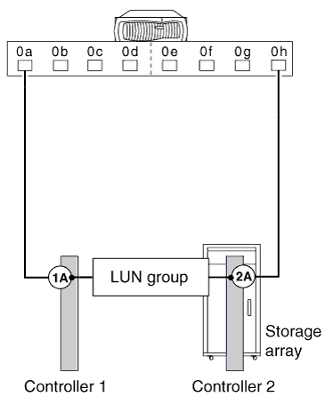

= Configurazioni direct-attached supportate con storage array E-Series
:allow-uri-read: 
:icons: font
:imagesdir: ../media/

[role="lead"]
Puoi collegare i sistemi ONTAP in configurazioni direct-attached con gli storage array E-Series. È necessario verificare la ridondanza nelle connessioni tra i sistemi ONTAP e gli array di storage per evitare la possibilità di un singolo punto di errore. FlexArray Stretch MetroCluster supporta le configurazioni direct-attached con storage array E-Series. Per ulteriori informazioni, vedere https://mysupport.netapp.com/matrix["Tool di matrice di interoperabilità NetApp"] e https://docs.netapp.com/us-en/ontap-metrocluster/install-stretch/index.html["Estensione dell'installazione e della configurazione di MetroCluster"].

La matrice di interoperabilità contiene informazioni sui modelli di array E-Series specifici supportati nelle configurazioni a collegamento diretto con il sistema ONTAP.

ONTAP supporta le seguenti configurazioni a collegamento diretto con gli storage array E-Series:

== Configurazione di base autonoma

In una configurazione di base standalone, due porte FC Initiator dal sistema ONTAP accedono alle porte di un gruppo LUN di array a due porte.

L'illustrazione seguente mostra una configurazione a collegamento diretto in cui le porte 0A e 0h dell'iniziatore FC di ONTAP accedono alle porte di destinazione di un gruppo LUN di array a due porte:

== Gruppo LUN di array a quattro porte

Due porte FC Initiator da ciascun sistema ONTAP in una coppia ha accedono a diverse porte di storage array in un gruppo LUN a quattro porte per la ridondanza delle connessioni.

L'illustrazione seguente mostra una configurazione a collegamento diretto in cui le porte dell'iniziatore FC ONTAP accedono alle porte di destinazione di un gruppo LUN di array a quattro porte.

image::../media/da_4port_hapair.gif[da 4port hapair]

È inoltre possibile collegare quattro porte FC Initiator da ciascun sistema ONTAP nella coppia ha a due diversi gruppi di LUN di array a quattro porte, in modo che ogni porta FC Initiator in una coppia di porte acceda al gruppo LUN alternativo.

L'illustrazione seguente mostra una configurazione a collegamento diretto in cui le porte dell'iniziatore FC ONTAP accedono alle porte di destinazione di due gruppi di LUN di array a quattro porte:

image::../media/direct_attached_configuration_with_two_four_port_array_lun_groups.gif[configurazione a collegamento diretto con due gruppi lun di array a quattro porte]

== Gruppo LUN di array a otto porte

Quattro porte FC Initiator da ciascun sistema ONTAP in una coppia ha accedono a diverse porte di storage array in un gruppo LUN di array a otto porte per la ridondanza delle connessioni.

L'illustrazione seguente mostra una configurazione a collegamento diretto in cui le porte dell'iniziatore FC ONTAP accedono alle porte di destinazione di un gruppo LUN di array a otto porte:

image::../media/eight_port_direct_attached_ha_pair_configuration.gif[configurazione con coppia ha direct-attached a otto porte]
