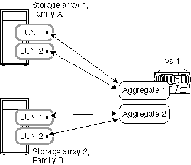

= Aggrega le regole quando gli storage array provengono da vendor o famiglie diversi
:allow-uri-read: 
:icons: font
:imagesdir: ../media/

[role="lead"]
Regole specifiche si applicano alla modalità di lay-out di array LUN in aggregati quando gli storage array provengono da vendor diversi o da famiglie di storage array differenti dello stesso vendor.

Le seguenti regole si applicano se gli storage array appartengono a vendor diversi o a famiglie diverse dello stesso vendor:

* Non puoi combinare array LUN di storage array di vendor diversi o di famiglie diverse dello stesso vendor nello stesso aggregato.
* È possibile associare l'aggregato contenente il volume root a qualsiasi storage array, indipendentemente dal tipo di famiglia di storage array.

[NOTE]
====
Quando si crea l'aggregato, assicurarsi di specificare esplicitamente gli ID delle LUN dell'array che si desidera aggiungere all'aggregato. Non utilizzare i parametri per specificare il numero e le dimensioni delle array LUN da utilizzare, in quanto il sistema potrebbe rilevare automaticamente le LUN di una famiglia diversa o dello storage array di un vendor diverso. Dopo che gli array LUN di famiglie o vendor diversi si trovano nello stesso aggregato, l'unico modo per risolvere il problema di LUN di array misti in un aggregato è distruggere l'aggregato e ricrearlo.

====
I seguenti esempi mostrano opzioni per la disposizione delle array LUN in aggregati quando gli storage array sono di _vendor diversi o di famiglie diverse dello stesso vendor_.

== Esempio 1: I LUN dei due storage array sono in aggregati diversi

In questo esempio, alcune LUN per ONTAP provengono dallo storage array 1, famiglia A, mentre le altre LUN per ONTAP sono dello storage array 2, famiglia B. i LUN dei due storage array non possono essere aggiunti allo stesso aggregato perché i due storage array appartengono a famiglie diverse dello stesso vendor. Lo stesso vale se i due storage array provenissero da vendor diversi.

== Esempio 2: Alcune LUN possono essere miste nello stesso aggregato, mentre altre no

In questo esempio, uno storage array proviene dalla famiglia A, mentre gli altri due storage array appartengono alla famiglia B. i LUN della famiglia A non possono essere aggiunti allo stesso aggregato dei LUN di uno storage array della famiglia B, perché gli storage array appartengono A famiglie diverse. Tuttavia, è possibile assegnare il LUN 1 dello storage array 3 all'aggregato 2, che contiene anche LUN dello storage array 2, poiché i due storage array si trovano nella stessa famiglia.

image::../media/luns_assigned_to_multiple_aggrs_dif_and_same_family.gif[Questo grafico è descritto dal testo circostante.]
