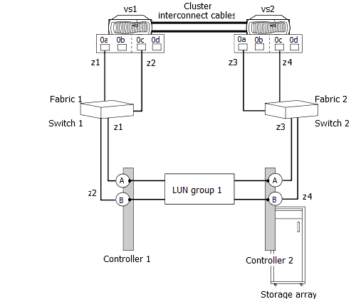

= Impostazione percorso non valida: I percorsi alternativi non sono configurati
:allow-uri-read: 
:icons: font
:imagesdir: ../media/

[role="lead"]
È importante impostare percorsi alternativi a tutte le LUN degli array da entrambi gli initiator FC sul sistema ONTAP, evitando così un single point of failure (SPOF).

La seguente configurazione non è valida perché non fornisce percorsi alternativi da ogni porta iniziatore FC sui sistemi ONTAP a ogni LUN sullo storage array. Entrambe le porte iniziatore FC dello stesso sistema ONTAP sono connesse allo storage array tramite lo stesso switch.

Si supponga che in questo esempio non valido sia presente la seguente suddivisione in zone:

* Per vs1:
+
** 0A viene compresso per vedere la porta a del controller 1
** 0C è compresso per vedere la porta B del controller 1

* Per vs2:
+
** 0A viene compresso per vedere la porta a del controller 2
** 0C è compresso per vedere la porta B del controller 2

In questa configurazione di esempio, ogni switch diventa un SPOF.

Per rendere questa configurazione valida, è necessario apportare le seguenti modifiche:

* La porta 0C dell'iniziatore FC di VS1 deve essere collegata allo switch 2.
* La porta 0A dell'iniziatore FC di VS2 deve essere collegata allo switch 1.
* È necessario configurare lo zoning appropriato.
+
Se si utilizzano più porte su uno storage array che supporta la configurazione di un set specifico di LUN su un set selezionato di porte, una determinata porta FC Initiator deve essere in grado di vedere tutte le LUN degli array presentate sul fabric.

