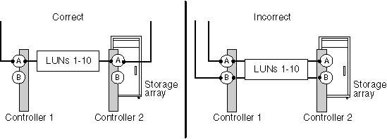

= Tutti i percorsi a un array LUN si trovano sullo stesso controller dello storage array
:allow-uri-read: 
:icons: font
:imagesdir: ../media/

[role="lead"]
ONTAP non supporta la configurazione di tutti i percorsi verso lo stesso controller di storage array perché così facendo imposta una configurazione con un single point of failure (SPOF). Il `storage errors show` comando identifica qualsiasi LUN di array i cui percorsi sono impostati per passare allo stesso controller di storage array.

ONTAP non consente di assegnare array LUN a un sistema ONTAP fino a quando non viene risolto questo errore.

== Gli errori di memorizzazione mostrano il messaggio

[listing]
----
NAME (UID): All paths to this array LUN are connected to the same fault domain. This is a single point of failure
----

== Spiegazione

Questo errore si verifica perché i percorsi a un LUN dell'array sono configurati in modo da passare allo stesso controller dell'array di storage o alla stessa FRU.

[NOTE]
====
L'utilizzo di quattro percorsi per un array LUN, un array di storage con FRU con più director (come EMC Symmetrix o HDS USP HDS) o un array di storage con controller doppi (come EMC CX o HP EVA) sono metodi validi per ottenere la ridondanza. Tuttavia, se si impostano i percorsi per passare attraverso un singolo controller di storage array o FRU, si sta impostando la configurazione con uno SPOF, anche con tali funzioni. Su un array di storage attivo-attivo, l'intera FRU è considerata come un dominio di errore. Uno storage array EMC Symmetrix, ad esempio, dispone di più direttori di canale sulla stessa scheda madre FEBE. Una scheda FEBE è considerata come un dominio di errore perché se tutti i percorsi passano attraverso la stessa scheda FEBE, si perdono tutti i percorsi se si deve sostituire la scheda.

====
L'illustrazione seguente mostra la selezione corretta e non corretta della porta dell'array di archiviazione per l'impostazione dei percorsi ridondanti a un LUN dell'array in modo che non si disponga di un singolo dominio di errore. L'impostazione del percorso nell'esempio a sinistra è corretta perché i percorsi al LUN dell'array sono ridondanti--ogni connessione è a una porta su un controller diverso sull'array di storage. Nell'esempio a destra, entrambi i percorsi al LUN dell'array vengono inviati allo stesso controller, che imposta uno SPOF.

Il `storage errors show` comando mostra il LUN dell'array che si trova nello stesso dominio di errore. Questo problema può essere visualizzato anche nell' `storage disk show` output se si guarda la colonna TPGN (numero del gruppo di porte di destinazione). Per ogni iniziatore in una coppia di porte iniziatori deve essere visualizzato un TPGN diverso. Se il TPGN è lo stesso per entrambi gli iniziatori della coppia, entrambi gli iniziatori si trovano nello stesso dominio di errore.

Nell'esempio seguente `storage disk show` viene illustrato TPGN 1 per LUN 30, a cui si accede tramite gli iniziatori 0A e 0C. Se i percorsi sono ridondanti, ogni iniziatore mostra un TPGN diverso.

[listing]
----

mysystem1::> storage disk show mysystem1:vgbr300s70:9.126L30
                  Disk: HP-1.15
        Container Type: unassigned
            Owner/Home: -  / -
               DR Home: -
                 Array: HP_HSV450_1
                Vendor: HP
                 Model: HSV450
         Serial Number: 600508B4000B63140000800001660000
                   UID: 600508B4:000B6314:00008000:01660000:00000000:...
                   BPS: 512
         Physical Size: -
              Position: present
Checksum Compatibility: block
             Aggregate: -
                  Plex: -
Paths:
                     LUN Initiator Side   Target Side
Controller Initiator ID  Switch Port      Switch Port     Acc Use  Target Port      TPGN...
---------- --------- --- ---------------- --------------- --- ---  ---------------- -----
mysystem1    0c      30  vgci9148s75:1-12 vgci9148s75:1-9 AO  RDY  50014380025d1509   1
mysystem1    0a      30  vgbr300s70:12    vgbr300s70:9    AO  INU  50014380025d1508   1

Errors:
HP-1.15 (600508b4000b63140000800001660000): All paths to this array LUN are connected to the same fault domain. This is a single point of failure.
----
[NOTE]
====
L'UID completo in questo esempio è 600508B4:000B6314:00008000:00000000:00000000:00000000:00000000:00000000:00000000:01660000. È troncato nell'esempio a causa dello spazio.

====

== Risoluzione dei problemi e risoluzione dei problemi

I percorsi verso il LUN dell'array devono essere riconfigurati in modo che vadano ai controller di array di storage o alle FRU ridondanti.

. Aggiungere un cavo alla porta di destinazione ridondante sull'altro controller.
+
È necessario mantenere la ridondanza mentre si risolve questo problema aggiungendo un cavo al controller alternativo _prima_ si rimuove un cavo dal controller con SPOF. La ridondanza viene mantenuta in questo caso perché si sta aumentando temporaneamente il numero di percorsi a tre percorsi invece di diminuire il numero di percorsi a uno mentre si sta risolvendo il problema.

. Rimuovere un cavo dalla centralina impostata con lo SPOF.
+
A questo punto si dispone di due percorsi ridondanti verso l'array LUN.

. Dalla riga di comando di ONTAP, immettere nuovamente il seguente comando e confermare che l'errore è stato corretto: `storage errors show`

