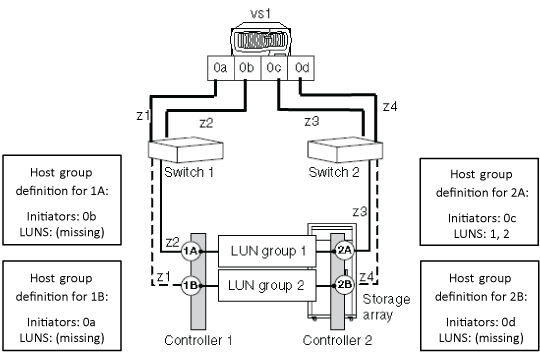

= Motivi dell'assenza di LUN nel gruppo di array LUN
:allow-uri-read: 
:icons: font
:imagesdir: ../media/

[role="lead"]
Durante la convalida della configurazione back-end, è necessario controllare l' `storage array config show` output per determinare se i LUN sono visualizzati nei gruppi LUN. Quando l' `storage array config show` output non mostra LUN in un gruppo di array LUN, ONTAP può vedere la porta di destinazione sul fabric ma la porta di destinazione non presenta array LUN a ONTAP.

Esistono diversi motivi per cui una porta di destinazione potrebbe non presentare LUN di array a ONTAP (una _porta di destinazione aperta_). I motivi di una porta di destinazione aperta possono essere diversi tra i diversi array di storage. Inoltre, i metodi per gestire i problemi relativi alle porte di destinazione aperte variano in base agli array di storage. Per tutti gli array di storage, la risoluzione dei problemi relativi alla causa di una porta di destinazione aperta deve includere la verifica della configurazione dell'array di archiviazione, compresa la configurazione del gruppo host.

Ad esempio, la causa potrebbe essere un _gruppo host vuoto_, che si presenta a ONTAP come una porta di destinazione aperta. Con un gruppo di host vuoto, il gruppo di host definisce le porte di destinazione e di iniziatore FC, ma non elenca i LUN di array (ovvero, il gruppo di host è vuoto).

[NOTE]
====
Il funzionamento dei sistemi ONTAP non è influenzato da un gruppo host vuoto.

====
L'illustrazione seguente rappresenta una situazione di porta di destinazione aperta e una situazione di gruppo host vuoto. (Per semplicità, nell'illustrazione viene utilizzato un sistema ONTAP autonomo).

La porta di destinazione aperta è causata da ID LUN mancanti nella definizione del gruppo host per il controller di storage 1A. Nella definizione del gruppo host per il controller di storage 1A, l'iniziatore FC 0b è compresso nella porta di destinazione e vi è un gruppo host definito per la porta iniziatore FC 0b, ma non vi sono ID LUN nel gruppo host. Come mostra l'illustrazione, la definizione del gruppo host per il controller di memorizzazione 2A include sia iniziatori che LUN.

Il gruppo di host vuoto è causato dai LUN degli array che non vengono elencati nella definizione del gruppo di host per i controller di storage 1B e 2B. Gli iniziatori FC 0A e 0d sono suddivisi in zone nelle porte di destinazione, ma non sono mostrati LUN.

L'esempio seguente mostra l' `storage array config show` output per le situazioni illustrate in cui il sistema ONTAP è sottoposto a zoning nella matrice di memorizzazione ma non ci sono LUN nelle definizioni di gruppo host per il controller di memorizzazione 1A, dando come risultato una porta di destinazione aperta. I controllori 1B e 2B non hanno LUN nelle rispettive definizioni di gruppi di host, dando come risultato un gruppo di host vuoto.

Nell'uscita per le situazioni illustrate, gli iniziatori FC 0A, 0b e 0d non mostrano LUN nel campo del conteggio LUN. Per l'iniziatore FC 0C, nella LUN group1 sono mostrate due LUN.

[listing]
----
cluster-1::> storage array config show
          LUN   LUN
Node      Group Count  Array Name       Array Target Port   Initiator
--------- ----- -----  ------------     ------------------- ---------
vs1
           0     2     EMC_SYMMETRIX_1  50060480000001b0       0c

           1     0     EMC_SYMMETRIX_1  50060480000001a0       0b

           2     0     EMC_SYMMETRIX_1  50060480000001b1       0a

                 0     EMC_SYMMETRIX_1  50060480000001a1       0d

4 entries were displayed.
----
[NOTE]
====
Dall'output è possibile determinare che il problema non è dovuto a iniziatori FC mancanti nel gruppo host. Se gli initiator FC non erano presenti nel gruppo host, ONTAP non sarebbe in grado di vedere i gruppi LUN senza LUN.

====